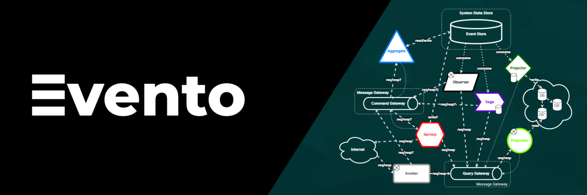

# [Evento Framework](https://www.eventoframework.com/)

## What is Evento Framework?

The Evento Framework equips developers with a robust toolkit for building and managing distributed applications that leverage the Event Sourcing and CQRS (Command Query Responsibility Segregation) architectural patterns. This potent combination empowers you to create:

-   **Resilient Systems:** Event sourcing guarantees data consistency and facilitates effortless recovery from unforeseen disruptions.
-   **Scalable Architectures:** Evento's distributed nature allows you to seamlessly scale your application horizontally to meet ever-growing demands.
-   **Maintainable Codebases:** The well-defined separation of concerns between commands, events, and queries promotes clean code and fosters easier reasoning about system behavior.
-   **Visualize Your System:** Gain a bird's-eye view of your application's architecture through intuitive GUIs provided by compatible monitoring tools. These tools can integrate seamlessly with Evento, allowing you to visualize components, event flows, and command execution.
-   **Comprehend Component Behavior:** Delve into the behavior of individual components within your application. Explore event handling, command processing, and query execution at a granular level to identify bottlenecks or unexpected interactions.
-   **Enriched Telemetry:** Evento gathers and exposes detailed telemetry data about your application's performance. This data includes metrics on event delivery, command execution times, and query response latencies. By analyzing this telemetry, you can optimize your application and ensure it delivers exceptional performance.

**Evento Framework: The Foundation Based on [RECQ Architecture](https://www.eventoframework.com/recq-patterns/)**

The Evento Framework, built upon the principles of the [RECQ (Reactive, Event-Driven Commands and Queries)](https://www.eventoframework.com/recq-patterns/) architecture, provides a comprehensive set of abstractions and APIs to navigate the world of event-driven development. RECQ emphasizes:

-   **Reactive Programming:** Evento embraces reactive principles, promoting responsiveness and elasticity in your applications.
-   **Event-Driven Communication:** Communication within your system primarily happens through events, leading to a loosely coupled and modular architecture.
-   **Command/Query Separation:** Evento adheres to CQRS, ensuring commands and queries flow through distinct channels, enhancing data integrity and performance.

**[Key Features of the Evento Framework](https://docs.eventoframework.com/evento-framework/evento-framework-introcution)**

The Evento Framework serves as the cornerstone of your development experience. It provides a comprehensive set of abstractions and APIs to navigate the world of event-driven development. Here's a glimpse into what you can accomplish with Evento:

-   **[Component-Based Architecture](https://docs.eventoframework.com/evento-framework/component):** Define your application logic through well-structured components annotated with `@Aggregate`, `@Projector`, or `@Saga`. These components encapsulate the core functionalities of your application.
-   **Automatic Discovery:** Evento intelligently scans your bundles (packaged application units) to identify these components, eliminating the need for tedious manual configuration.
-   **Performance Monitoring (Optional):** Gain valuable insights into the performance of your application by leveraging built-in monitoring capabilities.
-   **Flexible Configuration:** Tailored Evento's behavior to your specific project requirements through a rich set of configuration options.

**[Evento Server: The Orchestrator](https://docs.eventoframework.com/evento-server/evento-server-introduction)**

The Evento Server acts as the central nervous system for your distributed application. It performs several critical tasks:

-   **Bundle Management:** The server oversees the registration and discovery of your Evento bundles. It understands how these bundles interact and orchestrates communication between them.
-   **Event Processing:** The server acts as a robust event conduit, ensuring that events are delivered efficiently to the appropriate components within your bundles.
-   **Command Routing:** When commands are issued, the server deftly directs them to the designated command handlers within your bundles for efficient execution.
-   **Query Handling:** Similarly, the server acts as an intermediary for queries, directing them to the corresponding query handlers in your bundles to retrieve the requested data.

**Together, the Evento Framework and its Server form a cohesive ecosystem that simplifies and streamlines the creation of distributed applications. Embrace the Evento philosophy and experience the power of event sourcing and CQRS!**

## v2.0 — What's New

Evento Framework v2.0 is a ground-up rewrite of the transport and server bus:

- **CBOR wire protocol** — binary framing (4-byte length prefix + CBOR), replacing the v1 JSON/socket protocol. Wire-format compatibility with v1 is intentionally broken.
- **Netty transport** — fully async, virtual-thread business executor, transparent chunking (no message-size limit), optional TLS.
- **Sealed `Message` records** — exhaustive dispatch enforced by the compiler; adding a new wire type is a one-liner.
- **Exactly-once QoS** — dedup cache on both broker and bundle sides; callers can retry with the same `correlationId`.
- **v2 consumer engines** — `ProjectorEngine`, `SagaEngine`, `ObserverEngine` composed on focused SPIs (`ConsumerLock`, `ConsumerStateStore`, `SagaStateStore`, `DeadEventQueue`, `DedupeStore`). JDBC impls for Postgres and MySQL included.
- **Metrics-only, no built-in scaling** — the framework emits performance metrics only; cluster orchestration and instance lifecycle are external concerns (k8s / Nomad).
- **Zero-copy forwarding** — broker relays `Request`/`Response` as raw bytes without re-encoding.

## Getting Started

To start using Evento Framework, see the [Getting Started documentation](https://docs.eventoframework.com/getting-started/quick-start).

## Documentation

The documentation of Evento Framework includes:

- [Main documentation](https://docs.eventoframework.com/)
- [RECQ Patterns](https://docs.eventoframework.com/recq-patterns/recq-patterns)
- [Tutorial](https://docs.eventoframework.com/getting-started/todolist-recq-tutorial)
- [Evento Framework](https://docs.eventoframework.com/evento-framework/evento-framework-introcution)
- [Evento Server](https://docs.eventoframework.com/evento-server/evento-server-introduction)
- [Evento GUI](https://docs.eventoframework.com/evento-gui/explore-recq-systems-visually)

## Enterprise Repository Resources

- [Contributing guide](CONTRIBUTING.md) — environment setup, tests, branching, commits, and PR process.
- [Security policy](SECURITY.md) — supported versions and responsible disclosure process.
- [Support guide](SUPPORT.md) — where to ask questions, report bugs, and request commercial support.
- [Governance](GOVERNANCE.md) and [maintainers](MAINTAINERS.md) — project roles, decisions, releases, and ownership.
- [Agent notes](CLAUDE.md) — repository orientation for developer agents and maintainers.

## Community & Author

The Evento Framework is in its early stages, actively evolving with the contributions from the developer community. We need your help to shape Evento into a robust and widely adopted framework for distributed applications. Here's how you can get involved:

-   **Star⭐️ the Repository on GitHub:** Show your support and help us gain visibility! Find the Evento Framework on GitHub: [https://github.com/EventoFramework/evento-framework](https://github.com/EventoFramework/evento-framework)
-   **Follow on LinkedIn:** Stay up-to-date on the latest developments and announcements. Connect with me, the author, on LinkedIn: [Gabor Galazzo](https://www.linkedin.com/in/gabor-galazzo/)
-   **Contribute Code or Documentation:** We welcome contributions of all kinds. If you have an idea or find a bug, don't hesitate to submit a pull request or issue on GitHub.

By joining forces, we can make Evento a valuable tool for building the next generation of distributed applications!

## License
Copyright 2020-2026 © Gabor Galazzo. All rights reserved.

Evento Framework v2.0 is dual-licensed:

- **AGPL-3.0** — free for open-source projects. See [`LICENSE.txt`](LICENSE.txt).
- **Commercial licence** — for proprietary / closed-source use. See [`LICENSE-COMMERCIAL.txt`](LICENSE-COMMERCIAL.txt) or contact the author.
